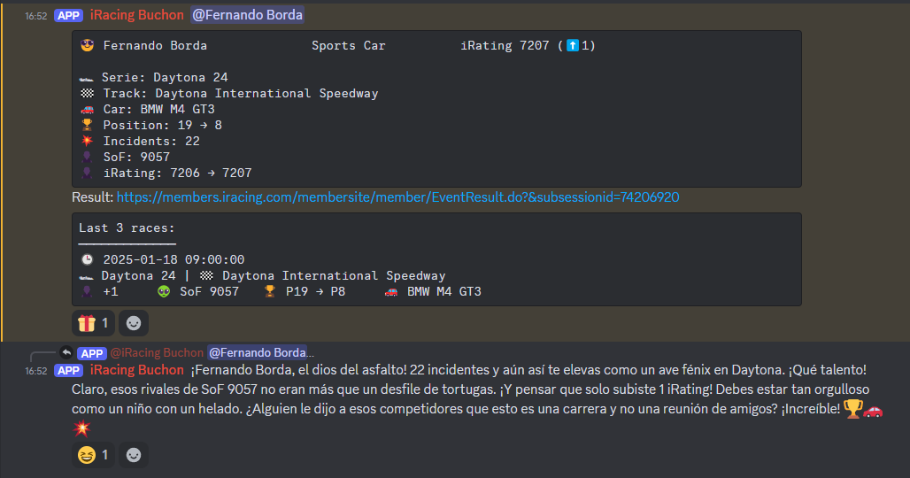

# iRacing FB Bot

**A Discord bot to track iRacing drivers and their statistics**

## 📌 Features
- Retrieves real-time statistics from iRacing.
- Displays iRating and other key metrics in a designated Discord channel.
- Allows administrators to manage the list of tracked drivers.
- AI reacts to race results on Discord.
- Bar chart showing iRating by category.




## 📄 Changelog
Check [CHANGELOG.md](./CHANGELOG.md) for a detailed list of changes.

## 📥 Installation & Usage

### 1️⃣ Initial Setup
1. Rename the file `env_base.php` to `env.php`.
2. Open `env.php` and configure the following variables:

```php
// Discord Configuration
DISCORD_TOKEN = "Your Discord bot token"
DISCORD_CHANNEL = "ID of the channel where the bot posts statistics"
DISCORD_CHANNEL_ADMIN = "ID of the admin channel for managing drivers"

// iRacing Credentials
IRACING_USER = "Your iRacing username"
IRACING_PASSWORD = "Your iRacing password"

// OpenAI Configuration (optional)
USE_OPENAI = 1  // Set to 1 to enable bot responses
OPENAI_API_KEY = "Your OpenAI API Key"
OPENAI_ASSISTANT_CONTEXT = "Context for OpenAI Assistant"
OPENAI_ASSISTANT_ID = "OpenAI Assistant ID"
OPENAI_MODEL = "Model to use (e.g., gpt-4)"
```

### 2️⃣ Install Dependencies
Ensure you have [Composer](https://getcomposer.org/) installed, then run:

```sh
composer install
```

### 3️⃣ Connect the Bot to Discord
To start the bot, run:

```sh
php main.php
```

To run the bot in the background:

```sh
nohup php main.php > bot.log 2>&1 &
```

To stop the bot when running in the background:

```sh
ps aux | grep main.php  # Find the bot process
kill <PID>  # Replace <PID> with the process ID
```

## 🛠 Available Commands
Type `!commands` in the `DISCORD_CHANNEL` to see the list of available commands.

### 📌 General Commands
| Command                     | Description |
|-----------------------------|-------------|
| `!irating <category> [<smurf>]` | Displays the iRating for all users in the specified category (`oval`, `sports_car`, `formula_car`, `dirt_oval`, `dirt_road`). `smurf` is optional and retrieves data for secondary accounts. Also generates a bar chart. |
| `!user list`                | Shows the list of registered users. |

### ⚙️ Admin Commands
| Command                      | Description |
|------------------------------|-------------|
| `!user add <id> <user_discord_id> [<smurf>]` | Adds a user to the database. `user_discord_id` allows mentioning users in race results. `smurf` is optional. |
| `!user delete <id>`          | Removes a user from the database. |
| `!user update <id>`          | Updates data for a specific user. |
| `!admin update`              | Updates data for all users (previously `!user updateall`). |

## 🔧 Maintenance & Updates
To update the bot to the latest version:

```sh
git pull
composer dump-autoload
php main.php
```

If making code changes, ensure you update the autoload configuration:

```sh
composer dump-autoload
```

## 📬 Support & Contact
For issues or suggestions, open an issue in the repository.
